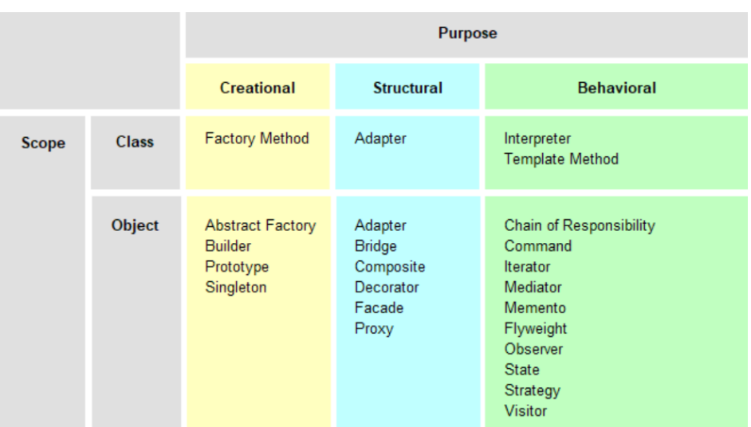

# OOP: Design Patterns
## Was sind Design Patterns ?
„Jedes Pattern beschreibt ein Problem, welches immer wieder vorkommt und dann
beschreibt es den Kern der Lösung des Problems, so dass Du diese Lösung eine
Million Mal verwenden kannst, ohne dass Du zweimal dasselbe machst.“
(Christopher Alexander über Patterns bei Gebäuden und Städten)

## Klassifikation von Design Patterns

